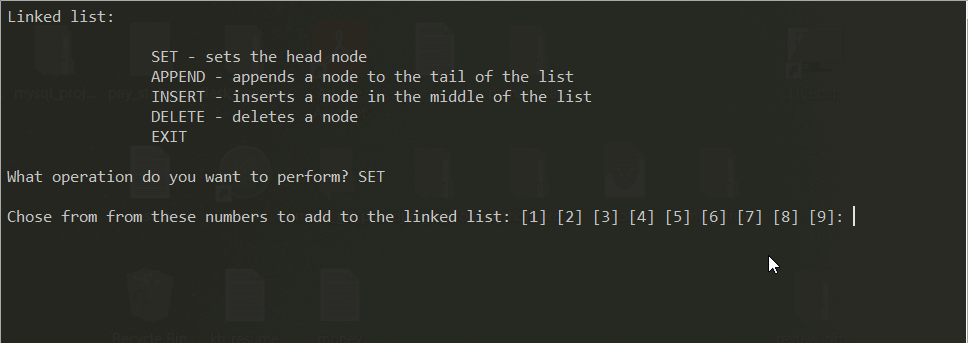

# Linked List (Python v.3.9.6)

### Todo
* python main.py

### Features

* Set the head of a linked list
* Append to the tail of the linked list
* Insert a node within the linked list
* Delete a node from the linked list

### Demo

